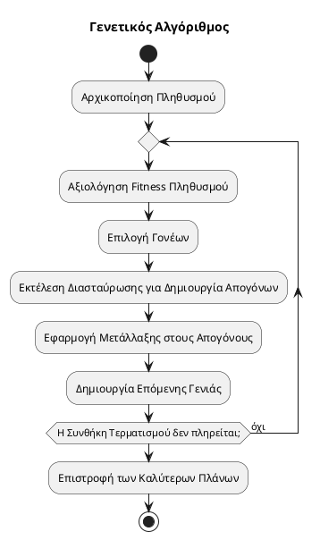

```plantuml
@startuml
title Γενετικός Αλγόριθμος

start
:Αρχικοποίηση Πληθυσμού;

repeat
  :Αξιολόγηση Fitness Πληθυσμού;
  :Επιλογή Γονέων;
  :Εκτέλεση Διασταύρωσης για Δημιουργία Απογόνων;
  :Εφαρμογή Μετάλλαξης στους Απογόνους;
  :Δημιουργία Επόμενης Γενιάς;
repeat while (Η Συνθήκη Τερματισμού δεν πληρείται;) is (όχι)

:Επιστροφή των Καλύτερων Πλάνων;
stop

@enduml
```
