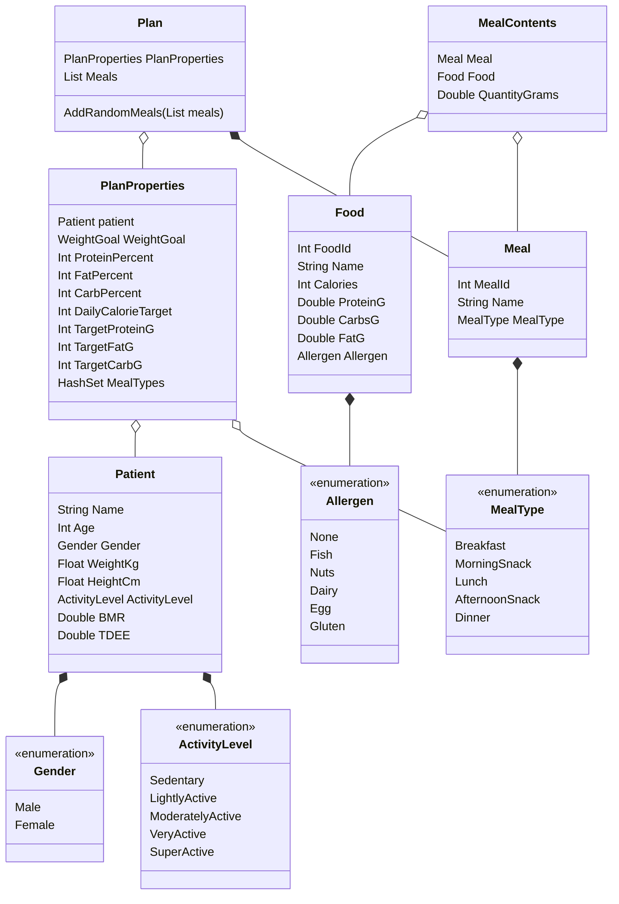

```mermaid
classDiagram
    class Patient {
        String Name
        Int Age
        Gender Gender
        Float WeightKg
        Float HeightCm
        ActivityLevel ActivityLevel
        Double BMR
        Double TDEE
    }
    class Gender{
        <<enumeration>>
        Male
        Female
    }
    class ActivityLevel{
        <<enumeration>>
        Sedentary
        LightlyActive
        ModeratelyActive
        VeryActive
        SuperActive
    }
    Patient *-- Gender
    Patient *-- ActivityLevel
    class Food {
        Int FoodId
        String Name
        Int Calories
        Double ProteinG
        Double CarbsG
        Double FatG
        Allergen Allergen
    }
    class Allergen {
        <<enumeration>>
        None
        Fish
        Nuts
        Dairy
        Egg
        Gluten
    }
    Food *-- Allergen
    class PlanProperties {
        Patient patient
        WeightGoal WeightGoal
        Int ProteinPercent
        Int FatPercent
        Int CarbPercent
        Int DailyCalorieTarget
        Int TargetProteinG
        Int TargetFatG
        Int TargetCarbG
        HashSet MealTypes
    }
    class Plan {
        PlanProperties PlanProperties
        List Meals
        AddRandomMeals(List meals)
    }
    class Meal {
        Int MealId
        String Name
        MealType MealType
    }
    class MealType {
        <<enumeration>>
        Breakfast
        MorningSnack
        Lunch
        AfternoonSnack
        Dinner
    }
    class MealContents {
        Meal Meal
        Food Food
        Double QuantityGrams
    }
    PlanProperties o-- Patient
    PlanProperties o-- MealType
    Plan o-- PlanProperties
    Plan *-- Meal
    Meal *-- MealType
    MealContents o-- Food
    MealContents o-- Meal

```
