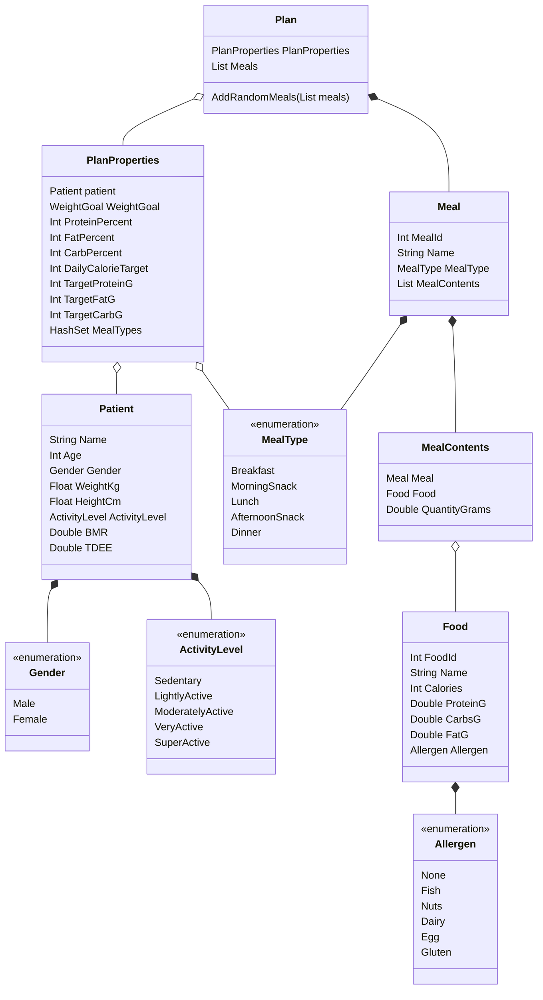

```mermaid
classDiagram
    class Plan {
        PlanProperties PlanProperties
        List Meals
        AddRandomMeals(List meals)
    }

    class PlanProperties {
        Patient patient
        WeightGoal WeightGoal
        Int ProteinPercent
        Int FatPercent
        Int CarbPercent
        Int DailyCalorieTarget
        Int TargetProteinG
        Int TargetFatG
        Int TargetCarbG
        HashSet MealTypes
    }
    
    Plan o-- PlanProperties
    Plan *-- Meal
    
    class Patient {
        String Name
        Int Age
        Gender Gender
        Float WeightKg
        Float HeightCm
        ActivityLevel ActivityLevel
        Double BMR
        Double TDEE
    }

    class Gender{
        <<enumeration>>
        Male
        Female
    }

    class ActivityLevel{
        <<enumeration>>
        Sedentary
        LightlyActive
        ModeratelyActive
        VeryActive
        SuperActive
    }
    
    PlanProperties o-- Patient
    Patient *-- Gender
    Patient *-- ActivityLevel

    class Meal {
        Int MealId
        String Name
        MealType MealType
        List MealContents
    }

    class MealType {
        <<enumeration>>
        Breakfast
        MorningSnack
        Lunch
        AfternoonSnack
        Dinner
    }
    
    Meal *-- MealType
    PlanProperties o-- MealType

    class MealContents {
        Meal Meal
        Food Food
        Double QuantityGrams
    }

    class Food {
        Int FoodId
        String Name
        Int Calories
        Double ProteinG
        Double CarbsG
        Double FatG
        Allergen Allergen
    }

    class Allergen {
        <<enumeration>>
        None
        Fish
        Nuts
        Dairy
        Egg
        Gluten
    }

    Meal *-- MealContents
    MealContents o-- Food
    Food *-- Allergen
```
