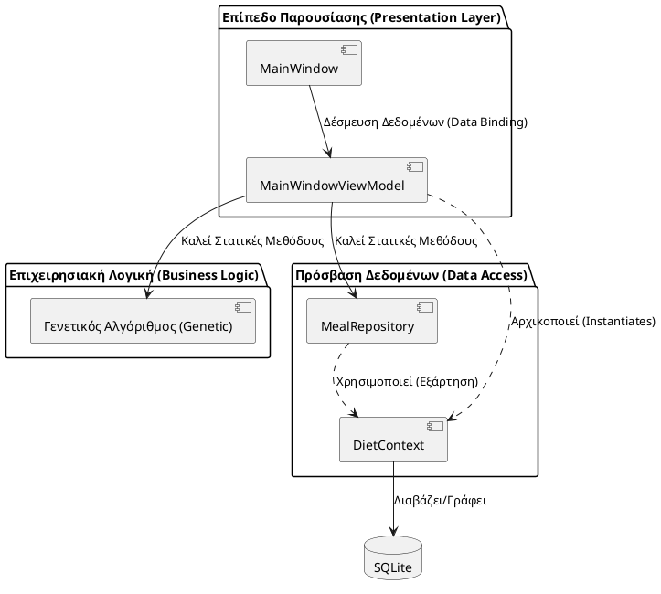

```plantuml
@startuml
skinparam componentStyle uml2

package "Επίπεδο Παρουσίασης (Presentation Layer)" {
    component [MainWindow] as View
    component [MainWindowViewModel] as ViewModel
}

package "Επιχειρησιακή Λογική (Business Logic)" {
    component [Γενετικός Αλγόριθμος (Genetic)] as Genetic
}

package "Πρόσβαση Δεδομένων (Data Access)" {
    component [MealRepository] as Repo
    component [DietContext] as DbContext
}

database "SQLite" as DB

View --> ViewModel : Δέσμευση Δεδομένων (Data Binding)
ViewModel ..> DbContext : Αρχικοποιεί (Instantiates)
ViewModel --> Genetic : Καλεί Στατικές Μεθόδους
ViewModel --> Repo : Καλεί Στατικές Μεθόδους
Repo ..> DbContext : Χρησιμοποιεί (Εξάρτηση)
DbContext --> DB : Διαβάζει/Γράφει

@enduml
```
