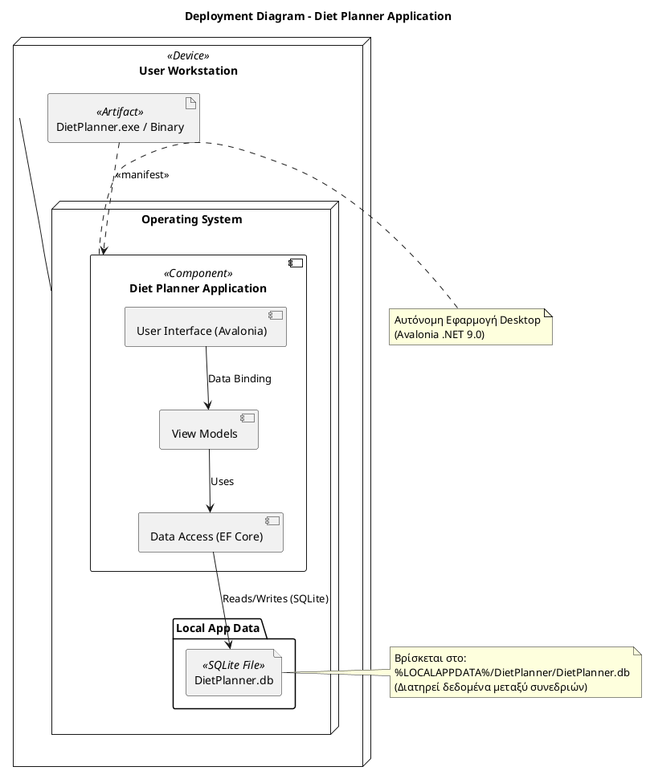

```plantuml
@startuml
title Deployment Diagram - Diet Planner Application

node "User Workstation" as UserComputer <<Device>> {

    node "Operating System" as OS {

        component "Diet Planner Application" as App <<Component>> {
            [User Interface (Avalonia)] as UI
            [View Models] as VM
            [Data Access (EF Core)] as DAL
        }

        folder "Local App Data" as AppData {
            file "DietPlanner.db" as DBFile <<SQLite File>>
        }
    }

    artifact "DietPlanner.exe / Binary" as Exe <<Artifact>>
}

' Relationships
UserComputer -- OS
Exe ..> App : <<manifest>>
UI --> VM : Data Binding
VM --> DAL : Uses
DAL --> DBFile : Reads/Writes (SQLite)

note right of DBFile
  Βρίσκεται στο:
  %LOCALAPPDATA%/DietPlanner/DietPlanner.db
  (Διατηρεί δεδομένα μεταξύ συνεδριών)
end note

note right of App
  Αυτόνομη Εφαρμογή Desktop
  (Avalonia .NET 9.0)
end note

@enduml
```
