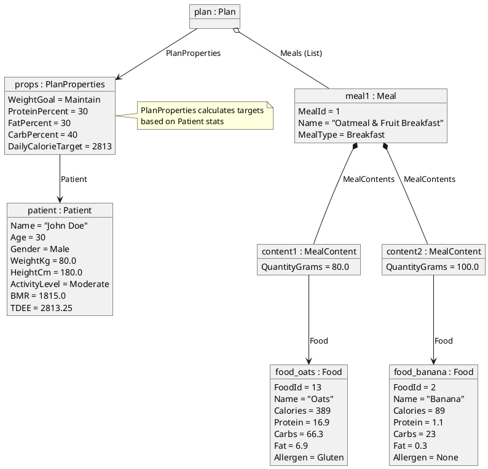

```plantuml
@startuml
object "patient : Patient" as patient {
    Name = "John Doe"
    Age = 30
    Gender = Male
    WeightKg = 80.0
    HeightCm = 180.0
    ActivityLevel = Moderate
    BMR = 1815.0
    TDEE = 2813.25
}

object "props : PlanProperties" as props {
    WeightGoal = Maintain
    ProteinPercent = 30
    FatPercent = 30
    CarbPercent = 40
    DailyCalorieTarget = 2813
}

object "plan : Plan" as plan {
}

object "meal1 : Meal" as meal1 {
    MealId = 1
    Name = "Oatmeal & Fruit Breakfast"
    MealType = Breakfast
}

object "content1 : MealContent" as content1 {
    QuantityGrams = 80.0
}

object "content2 : MealContent" as content2 {
    QuantityGrams = 100.0
}

object "food_oats : Food" as oats {
    FoodId = 13
    Name = "Oats"
    Calories = 389
    Protein = 16.9
    Carbs = 66.3
    Fat = 6.9
    Allergen = Gluten
}

object "food_banana : Food" as banana {
    FoodId = 2
    Name = "Banana"
    Calories = 89
    Protein = 1.1
    Carbs = 23
    Fat = 0.3
    Allergen = None
}

' Relationships
props --> patient : Patient
plan --> props : PlanProperties
plan o-- meal1 : Meals (List)
meal1 *-- content1 : MealContents
meal1 *-- content2 : MealContents
content1 --> oats : Food
content2 --> banana : Food

note right of props
  PlanProperties calculates targets
  based on Patient stats
end note

@enduml
```
