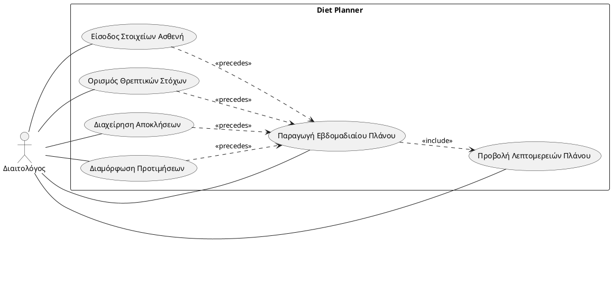

```plantuml
@startuml
left to right direction
skinparam packageStyle rectangle
actor Διαιτολόγος

rectangle "Diet Planner" {
    usecase "Είσοδος Στοιχείων Ασθενή" as UC1
    usecase "Ορισμός Θρεπτικών Στόχων" as UC2
    usecase "Διαχείρηση Αποκλήσεων" as UC3
    usecase "Διαμόρφωση Προτιμήσεων" as UC4
    usecase "Παραγωγή Εβδομαδιαίου Πλάνου" as UC5
    usecase "Προβολή Λεπτομερειών Πλάνου" as UC6

    ' Connections to Actor
    Διαιτολόγος -- UC1
    Διαιτολόγος -- UC2
    Διαιτολόγος -- UC3
    Διαιτολόγος -- UC4
    Διαιτολόγος -- UC5
    Διαιτολόγος -- UC6

    ' Relationships between Use Cases
    UC1 ..> UC5 : <<precedes>>
    UC2 ..> UC5 : <<precedes>>
    UC3 ..> UC5 : <<precedes>>
    UC4 ..> UC5 : <<precedes>>
    UC5 ..> UC6 : <<include>>
}
@enduml
```
